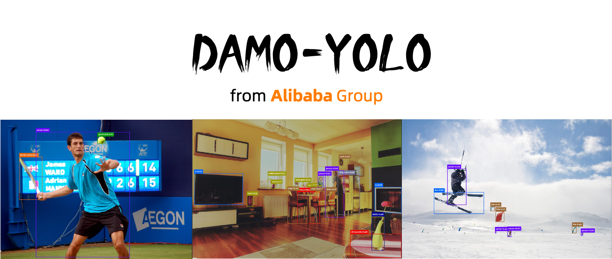
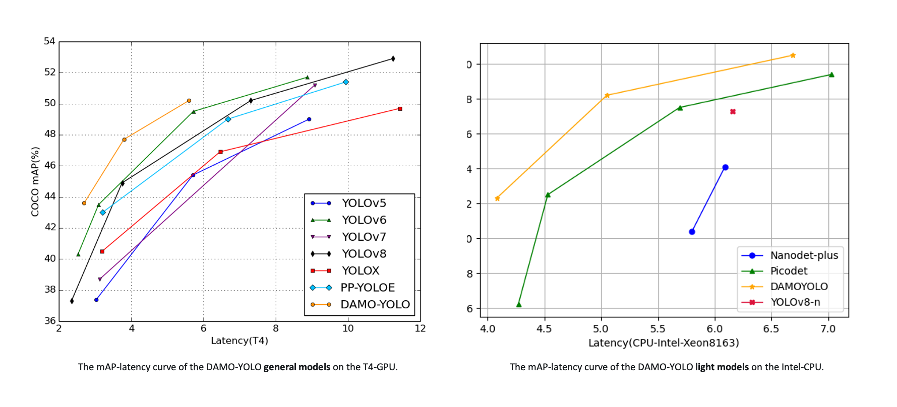
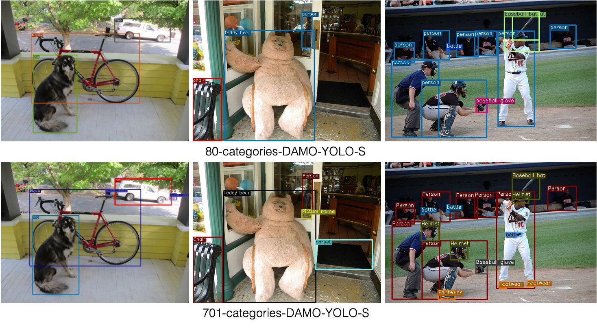
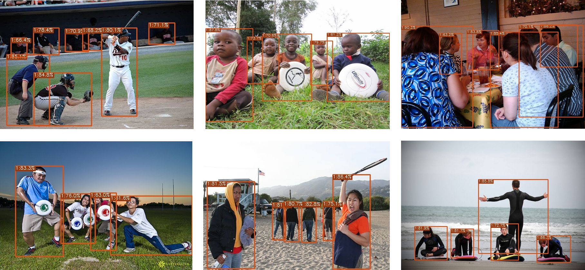
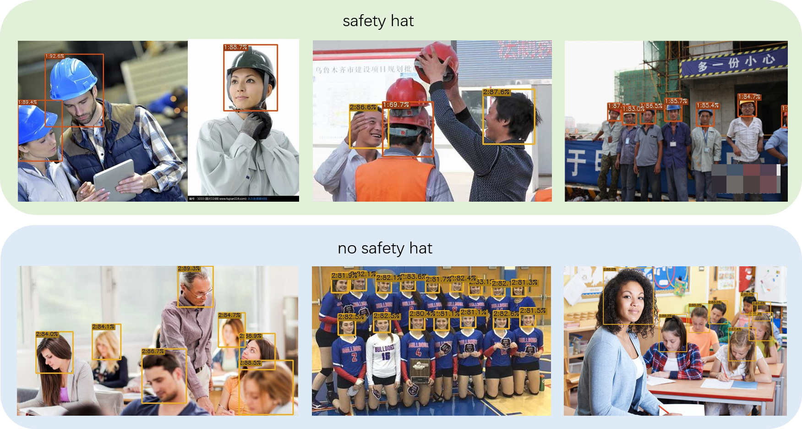
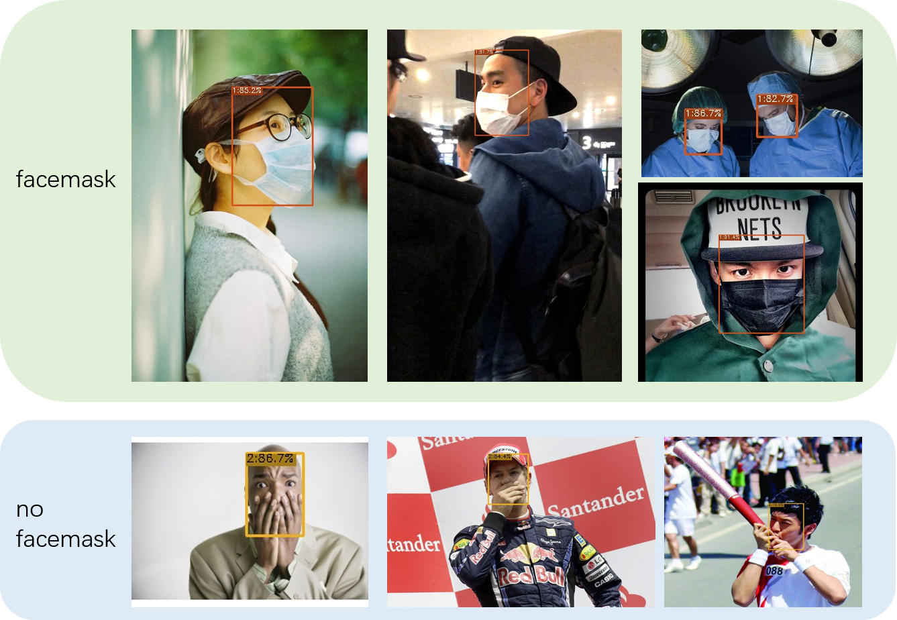
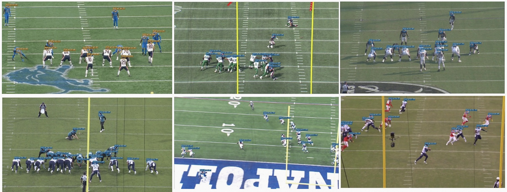

[English](README.md) | 简体中文

<div align="center">


[](README.md)
[](#third-parry-resources)
[](#industry-application-models)

</div>


## 简介
<div align="center"></div>

欢迎来到**DAMO-YOLO**！DAMO-YOLO是由阿里巴巴达摩院智能计算实验室TinyML团队开发的一个兼顾速度与精度的目标检测框架,其效果超越了目前的一众YOLO系列方法，在实现SOTA的同时，保持了很高的推理速度。DAMO-YOLO是在YOLO框架基础上引入了一系列新技术，对整个检测框架进行了大幅的修改。具体包括：基于NAS搜索的高效检测骨干网络，更深的多尺度特征融合检测颈部，精简的检测头结构，以及引入蒸馏技术实现效果的进一步提升。具体细节可以参考我们的[技术报告](https://arxiv.org/abs/2211.15444)。模型之外，DAMO-YOLO还提供高效的训练策略以及便捷易用的部署工具，帮助您快速解决工业落地中的实际问题！

<div align="center"></div>

## 更新日志
- **[2023/04/12: DAMO-YOLO v0.3.1更新!] **
    * 增加可检测701类别的DAMO-YOLO-S模型，该模型可覆盖更多应用场景，同时可作为优质预训练模型，提升下游任务性能。
    * 升级面向端上的DAMO-YOLO-Nano系列模型，仅用1.56/3.69/6.04GFlops即可在COCO数据集上达到32.3/38.2/40.5的mAP，在Intel-CPU平台上运行latency仅需4.08/5.05/6.69毫秒。
    * 增加DAMO-YOLO-L模型，该模型在COCO数据集上mAP达到51.9，使用T4-GPU推理仅需7.95ms的推理时延。
- **[2023/03/13: DAMO-YOLO v0.3.0更新!]**
    * 开源面向端上的DAMO-YOLO-Nano模型，仅用3.02GFLops在COCO数据集上达到35.1的mAP。
    * 更新升级了optimizer builder，现在通过编辑config文件中的optimizer，即可使用任意一款Pytorch支持的优化器进行训练。
    * 更新了data loader流程，给DAMO-YOLO全系列模型精度带来显著提升，其中DAMO-YOLO-S模型mAP从46.8提升到47.7，DAMO-YOLO-T模型mAP从43.0提升到43.6。
- **[2023/02/15: 第三届无人机检测竞赛基准。]**
    * 欢迎大家参加CVPR2023举办的[第三届无人机检测竞赛](https://anti-uav.github.io/Evaluate/)。比赛提供了基于DAMO-YOLO框架训练的基准模型，[DamoYolo_Anti-UAV-23_S](https://modelscope.cn/models/damo/cv_tinynas_uav-detection_damoyolo/summary)。
- **[2023/01/07: DAMO-YOLO v0.2.1更新!]**
    * 增加[TensorRT Int8部分量化教程](./tools/partial_quantization/README.md)，实现19%提速仅损失0.3%精度。
    * 增加[通用demo工具](#快速上手)，支持TensorRT/Onnx/Torch引擎实现视频/图像/摄像头推理。
    * 基于ModelScope增加[工业应用模型](#industry-application-models)，包括[人体检测](https://www.modelscope.cn/models/damo/cv_tinynas_human-detection_damoyolo/summary), [安全帽检测](https://www.modelscope.cn/models/damo/cv_tinynas_object-detection_damoyolo_safety-helmet/summary)，[口罩检测](https://www.modelscope.cn/models/damo/cv_tinynas_object-detection_damoyolo_facemask/summary)和[香烟检测](https://www.modelscope.cn/models/damo/cv_tinynas_object-detection_damoyolo_cigarette/summary)。
    * 增加[第三方资源](#第三方资源)板块，收集汇总第三方内容，目前包括[DAMO-YOLO代码解读](https://blog.csdn.net/jyyqqq/article/details/128419143), [DAMO-YOLO自有数据训练范例](https://blog.csdn.net/Cwhgn/article/details/128447380?spm=1001.2014.3001.5501)。 
-  **[2022/12/15: DAMO-YOLO v0.1.1更新!]**
    * 增加详细的[自有数据微调模型教程](./assets/CustomDatasetTutorial.md)。
    * 修复了空标签数据导致训练卡住的问题[issue #30](https://github.com/tinyvision/DAMO-YOLO/issues/30)，如您使用中遇到任何问题，欢迎随时反馈，我们24小时待命。

## 线上Demo
- 线上Demo已整合至ModelScope，快去[DAMO-YOLO-T](https://www.modelscope.cn/models/damo/cv_tinynas_object-detection_damoyolo-t/summary)，[DAMO-YOLO-S](https://modelscope.cn/models/damo/cv_tinynas_object-detection_damoyolo/summary)，[DAMO-YOLO-M](https://www.modelscope.cn/models/damo/cv_tinynas_object-detection_damoyolo-m/summary) 体验一下吧！**ModelScope正免费提供GPU资源，并已支持DAMO-YOLO训练，快去试试吧！**

## 模型库
### 通用模型

|Model |size |mAP<sup>val<br>0.5:0.95 | Latency T4<br>TRT-FP16-BS1| FLOPs<br>(G)| Params<br>(M)| AliYun Download | Google Download|
| ------        |:---: | :---:     |:---:|:---: | :---: | :---:| :---:|
|[DAMO-YOLO-T](./configs/damoyolo_tinynasL20_T.py) | 640 | 42.0  | 2.78  | 18.1  | 8.5  |[torch](https://idstcv.oss-cn-zhangjiakou.aliyuncs.com/DAMO-YOLO/release_model/clean_model_0317/damoyolo_tinynasL20_T_420.pth),[onnx](https://idstcv.oss-cn-zhangjiakou.aliyuncs.com/DAMO-YOLO/release_model/onnx/damoyolo_tinynasL20_T_420.onnx)|--|
|[DAMO-YOLO-T*](./configs/damoyolo_tinynasL20_T.py) | 640 | 43.6  | 2.78  | 18.1  | 8.5  |[torch](https://idstcv.oss-cn-zhangjiakou.aliyuncs.com/DAMO-YOLO/release_model/clean_model_0317/damoyolo_tinynasL20_T_436.pth),[onnx](https://idstcv.oss-cn-zhangjiakou.aliyuncs.com/DAMO-YOLO/release_model/onnx/damoyolo_tinynasL20_T_436.onnx)|--|
|[DAMO-YOLO-S](./configs/damoyolo_tinynasL25_S.py) | 640 | 46.0  | 3.83  | 37.8  | 16.3  |[torch](https://idstcv.oss-cn-zhangjiakou.aliyuncs.com/DAMO-YOLO/release_model/clean_model_0317/damoyolo_tinynasL25_S_460.pth),[onnx](https://idstcv.oss-cn-zhangjiakou.aliyuncs.com/DAMO-YOLO/release_model/onnx/damoyolo_tinynasL25_S_460.onnx)|--|
|[DAMO-YOLO-S*](./configs/damoyolo_tinynasL25_S.py) | 640 | 47.7  | 3.83  | 37.8  | 16.3 |[torch](https://idstcv.oss-cn-zhangjiakou.aliyuncs.com/DAMO-YOLO/release_model/clean_model_0317/damoyolo_tinynasL25_S_477.pth),[onnx](https://idstcv.oss-cn-zhangjiakou.aliyuncs.com/DAMO-YOLO/release_model/onnx/damoyolo_tinynasL25_S_477.onnx) |--|
|[DAMO-YOLO-M](./configs/damoyolo_tinynasL35_M.py) | 640 | 49.2  | 5.62  | 61.8  | 28.2  |[torch](https://idstcv.oss-cn-zhangjiakou.aliyuncs.com/DAMO-YOLO/release_model/clean_model_0317/damoyolo_tinynasL35_M_492.pth),[onnx](https://idstcv.oss-cn-zhangjiakou.aliyuncs.com/DAMO-YOLO/release_model/onnx/damoyolo_tinynasL35_M_492.onnx)|--|
|[DAMO-YOLO-M*](./configs/damoyolo_tinynasL35_M.py) | 640 | 50.2  | 5.62  | 61.8  | 28.2 |[torch](https://idstcv.oss-cn-zhangjiakou.aliyuncs.com/DAMO-YOLO/release_model/clean_model_0317/damoyolo_tinynasL35_M_502.pth),[onnx](https://idstcv.oss-cn-zhangjiakou.aliyuncs.com/DAMO-YOLO/release_model/onnx/damoyolo_tinynasL35_M_502.onnx)|--|
|[DAMO-YOLO-L](./configs/damoyolo_tinynasL45_L.py) | 640 | 50.8  | 7.95  | 97.3  | 42.1  |[torch](https://idstcv.oss-cn-zhangjiakou.aliyuncs.com/DAMO-YOLO/release_model/clean_model_0317/damoyolo_tinynasL45_L_508.pth),[onnx](https://idstcv.oss-cn-zhangjiakou.aliyuncs.com/DAMO-YOLO/release_model/onnx/damoyolo_tinynasL45_L_508.onnx)|--|
|[DAMO-YOLO-L*](./configs/damoyolo_tinynasL45_L.py) | 640 | 51.9  | 7.95  | 97.3  | 42.1  |[torch](https://idstcv.oss-cn-zhangjiakou.aliyuncs.com/DAMO-YOLO/release_model/clean_model_0317/damoyolo_tinynasL45_L_519.pth),[onnx](https://idstcv.oss-cn-zhangjiakou.aliyuncs.com/DAMO-YOLO/release_model/onnx/damoyolo_tinynasL45_L_519.onnx)|--|


<details>

<summary>旧版模型</summary>

|Model |size |mAP<sup>val<br>0.5:0.95 | Latency T4<br>TRT-FP16-BS1| FLOPs<br>(G)| Params<br>(M)| Download |
| ------        |:---: | :---:     |:---:|:---: | :---: | :---:|
|[DAMO-YOLO-T](./configs/damoyolo_tinynasL20_T.py) | 640 | 41.8  | 2.78  | 18.1  | 8.5  |[torch](https://idstcv.oss-cn-zhangjiakou.aliyuncs.com/DAMO-YOLO/clean_models/before_distill/damoyolo_tinynasL20_T_418.pth),[onnx](https://idstcv.oss-cn-zhangjiakou.aliyuncs.com/DAMO-YOLO/onnx/before_distill/damoyolo_tinynasL20_T_418.onnx)  |
|[DAMO-YOLO-T*](./configs/damoyolo_tinynasL20_T.py) | 640 | 43.0  | 2.78  | 18.1  | 8.5  |[torch](https://idstcv.oss-cn-zhangjiakou.aliyuncs.com/DAMO-YOLO/clean_models/damoyolo_tinynasL20_T.pth),[onnx](https://idstcv.oss-cn-zhangjiakou.aliyuncs.com/DAMO-YOLO/onnx/damoyolo_tinynasL20_T.onnx)  |
|[DAMO-YOLO-S](./configs/damoyolo_tinynasL25_S.py) | 640 | 45.6  | 3.83  | 37.8  | 16.3 |[torch](https://idstcv.oss-cn-zhangjiakou.aliyuncs.com/DAMO-YOLO/clean_models/before_distill/damoyolo_tinynasL25_S_456.pth),[onnx](https://idstcv.oss-cn-zhangjiakou.aliyuncs.com/DAMO-YOLO/onnx/before_distill/damoyolo_tinynasL25_S_456.onnx)  |
|[DAMO-YOLO-S*](./configs/damoyolo_tinynasL25_S.py) | 640 | 46.8  | 3.83  | 37.8  | 16.3 |[torch](https://idstcv.oss-cn-zhangjiakou.aliyuncs.com/DAMO-YOLO/clean_models/damoyolo_tinynasL25_S.pth),[onnx](https://idstcv.oss-cn-zhangjiakou.aliyuncs.com/DAMO-YOLO/onnx/damoyolo_tinynasL25_S.onnx)  |
|[DAMO-YOLO-M](./configs/damoyolo_tinynasL35_M.py) | 640 | 48.7  | 5.62  | 61.8  | 28.2 |[torch](https://idstcv.oss-cn-zhangjiakou.aliyuncs.com/DAMO-YOLO/clean_models/before_distill/damoyolo_tinynasL35_M_487.pth),[onnx](https://idstcv.oss-cn-zhangjiakou.aliyuncs.com/DAMO-YOLO/onnx/before_distill/damoyolo_tinynasL35_M_487.onnx)|
|[DAMO-YOLO-M*](./configs/damoyolo_tinynasL35_M.py) | 640 | 50.0  | 5.62  | 61.8  | 28.2 |[torch](https://idstcv.oss-cn-zhangjiakou.aliyuncs.com/DAMO-YOLO/clean_models/damoyolo_tinynasL35_M.pth),[onnx](https://idstcv.oss-cn-zhangjiakou.aliyuncs.com/DAMO-YOLO/onnx/damoyolo_tinynasL35_M.onnx)|

</details>

- 上表中汇报的是COCO2017 val集上的结果, 测试时使用multi-class NMS。
- 其中latency中不包括后处理时间（NMS）。
- \* 表示模型训练时使用蒸馏。
- 蒸馏时，使用S作为老师蒸馏T，M作为老师蒸馏S，L作为老师蒸馏M，而L则进行自蒸馏。

### 端上模型
|Model |size |mAP<sup>val<br>0.5:0.95 | Latency(ms) CPU<br> OpenVino-Intel8163| FLOPs<br>(G)| Params<br>(M)| AliYun Download | Google Download|
| ------        |:---: | :---:     |:---:|:---: | :---: | :---:| :---:|
| [DAMO-YOLO-Ns](./configs/damoyolo_tinynasL18_Ns.py)| 416| 32.3 | 4.08| 1.56 | 1.41 | [torch](https://idstcv.oss-cn-zhangjiakou.aliyuncs.com/DAMO-YOLO/release_model/ckpt/before_distill/damoyolo_nano_small.pth),[onnx](https://idstcv.oss-cn-zhangjiakou.aliyuncs.com/DAMO-YOLO/release_model/onnx/before_distill/damoyolo_tinynasL18_Ns.onnx) | -- |
| [DAMO-YOLO-Nm](./configs/damoyolo_tinynasL18_Nm.py)| 416| 38.2 | 5.05| 3.69 | 2.71 | [torch](https://idstcv.oss-cn-zhangjiakou.aliyuncs.com/DAMO-YOLO/release_model/ckpt/before_distill/damoyolo_nano_middle.pth),[onnx](https://idstcv.oss-cn-zhangjiakou.aliyuncs.com/DAMO-YOLO/release_model/onnx/before_distill/damoyolo_tinynasL18_Nm.onnx) | -- |
| [DAMO-YOLO-Nl](./configs/damoyolo_tinynasL20_Nl.py)| 416| 40.5 | 6.69| 6.04 | 5.69 | [torch](https://idstcv.oss-cn-zhangjiakou.aliyuncs.com/DAMO-YOLO/release_model/ckpt/before_distill/damoyolo_nano_large.pth),[onnx](https://idstcv.oss-cn-zhangjiakou.aliyuncs.com/DAMO-YOLO/release_model/onnx/before_distill/damoyolo_tinynasL20_Nl.onnx) | -- |

- 上表中汇报的是COCO2017 val集上的结果, 测试时使用multi-class NMS。
- 其中latency中不包括后处理时间。
- Latency测试基于[OpenVINO-2022.3.0](https://github.com/openvinotoolkit/openvino)，可以通过如下的配置修改和命令复现该测速结果:
    ```shell
    # onnx export, enable --benchmark to ignore postprocess
    python tools/converter.py -f configs/damoyolo_tinynasL18_Ns.py -c ../damoyolo_tinynasL18_Ns.pth --batch_size 1  --img_size 416 --benchmark
    # model transform
    mo --input_model damoyolo_tinynasL18_Ns.onnx --data_type FP16
    # latency benchmark
    ./benchmark_app -m damoyolo_tinynasL18_Ns.xml -i ./assets/dog.jpg -api sync -d CPU -b 1 -hint latency 
    ```
 
 ### 701类通用检测模型
我们提供了可检测701类别的DAMO-YOLO-S模型，该模型在包括COCO、Objects365和OpenImage在内的大型数据集上进行了训练，可覆盖更多应用场景。同时该模型可作为优质预训练模型，显著提升下游检测任务性能。
|Pretrained Model | Downstream Task |mAP<sup>val<br>0.5:0.95 | AliYun Download | Google Download|
| ------        |:---: | :---:     |:---:|:---: |
| 80-categories-DAMO-YOLO-S | VisDrone | 24.6 | [torch](https://idstcv.oss-cn-zhangjiakou.aliyuncs.com/DAMO-YOLO/clean_models/before_distill/damoyolo_tinynasL25_S_456.pth),[onnx](https://idstcv.oss-cn-zhangjiakou.aliyuncs.com/DAMO-YOLO/onnx/before_distill/damoyolo_tinynasL25_S_456.onnx) | - |
| 701-categories-DAMO-YOLO-S | VisDrone | 26.6 | [torch](http://idstcv.oss-cn-zhangjiakou.aliyuncs.com/DAMO-YOLO/Large-Scale-Training/damo_yolo_s_700%2B.pth),[onnx](http://idstcv.oss-cn-zhangjiakou.aliyuncs.com/DAMO-YOLO/Large-Scale-Training/damo_yolo_s_700%2B.onnx) | - |
- 可下载链接为701类别的预训练的模型，我们此处展示了VisDrone的精度对比来表明我们的预训练模型可以提高下游任务的性能。
<div align="left"></div>


## 快速上手

<details>
<summary>安装</summary>

步骤一.  安装DAMO-YOLO.
```shell
git clone https://github.com/tinyvision/DAMO-YOLO.git
cd DAMO-YOLO/
conda create -n DAMO-YOLO python=3.7 -y
conda activate DAMO-YOLO
conda install pytorch==1.7.0 torchvision==0.8.0 torchaudio==0.7.0 cudatoolkit=10.2 -c pytorch
pip install -r requirements.txt
export PYTHONPATH=$PWD:$PYTHONPATH
```
步骤二. 安装[pycocotools](https://github.com/cocodataset/cocoapi).

```shell
pip install cython;
pip install git+https://github.com/cocodataset/cocoapi.git#subdirectory=PythonAPI # for Linux
pip install git+https://github.com/philferriere/cocoapi.git#subdirectory=PythonAPI # for Windows
```
</details>

<details>
<summary>Demo</summary>

步骤一. 从模型库中下载训练好的torch模型，onnx或tensorRt推理引擎，例如damoyolo_tinynasL25_S.pth，damoyolo_tinynasL25_S.onnx或damoyolo_tinynasL25_S.trt

步骤二. 执行命令时用-f选项指定配置(config)文件，--engine指定推理引擎，--path指定推理输入数据（支持图片和视频）, --camid指定摄像头（仅在输入类型为camera时生效）。具体命令如下:
```shell
# torch 图像推理
python tools/demo.py image -f ./configs/damoyolo_tinynasL25_S.py --engine ./damoyolo_tinynasL25_S.pth --conf 0.6 --infer_size 640 640 --device cuda --path ./assets/dog.jpg

# onnx 视频推理
python tools/demo.py video -f ./configs/damoyolo_tinynasL25_S.py --engine ./damoyolo_tinynasL25_S.onnx --conf 0.6 --infer_size 640 640 --device cuda --path your_video.mp4

# tensorRT 摄像头推理

python tools/demo.py camera -f ./configs/damoyolo_tinynasL25_S.py --engine ./damoyolo_tinynasL25_S.trt --conf 0.6 --infer_size 640 640 --device cuda --camid 0
```

</details>

<details>
<summary>从头开始，复现COCO上的精度</summary>

步骤一. 准备好COCO数据集,推荐将coco数据软链接到datasets目录下。
```shell
cd <DAMO-YOLO Home>
ln -s /path/to/your/coco ./datasets/coco
```

步骤二. 在COCO数据上进行训练，使用-f选项指定配置(config)文件。
```shell
python -m torch.distributed.launch --nproc_per_node=8 tools/train.py -f configs/damoyolo_tinynasL25_S.py
```
</details>

<details>
<summary>在自定义数据上微调模型</summary>

请参考[自有数据微调模型教程](./assets/CustomDatasetTutorial.md)。

</details>


<details>
<summary>在COCO val上测评训练好的模型</summary>

```shell
python -m torch.distributed.launch --nproc_per_node=8 tools/eval.py -f configs/damoyolo_tinynasL25_S.py --ckpt /path/to/your/damoyolo_tinynasL25_S.pth
```
</details>


<details>
<summary>使用TinyNAS自定义DAMO-YOLO骨干网络</summary>

步骤1. 如果您想自定义DAMO-YOLO骨干网络，可以参考[适用于DAMO-YOLO的MAE-NAS教程](https://github.com/alibaba/lightweight-neural-architecture-search/blob/main/scripts/damo-yolo/Tutorial_NAS_for_DAMO-YOLO_cn.md)，通过该教程您可以一步步学习如何使用latency/flops作为约束条件搜索该条件下的最优模型。 

步骤2. 模型搜索结束后，您可以使用搜索得到的模型结构文件替换config中的structure text。把Backbone的name设置成TinyNAS_res或者TinyNAS_csp，将会分别得到ResNet或者CSPNet形式的TinyNAS骨干网络, 请注意到TinyNAS_res骨干网络的out_indices=(2,4,5)而TinyNAS_csp骨干网络的out_indices=(2,3,4)。
```
structure = self.read_structure('tinynas_customize.txt')
TinyNAS = { 'name'='TinyNAS_res', # ResNet形式的Tinynas骨干网络
            'out_indices': (2,4,5)}
TinyNAS = { 'name'='TinyNAS_csp', # CSPNet形式的Tinynas骨干网络
            'out_indices': (2,3,4)}

```
</details>


## 部署

<details>
<summary>安装依赖项</summary>

步骤1. 安装 ONNX.
```shell
pip install onnx==1.8.1
pip install onnxruntime==1.8.0
pip install onnx-simplifier==0.3.5
```
步骤2. 安装 CUDA、CuDNN、TensorRT and pyCUDA

2.1 CUDA
```shell
wget https://developer.download.nvidia.com/compute/cuda/10.2/Prod/local_installers/cuda_10.2.89_440.33.01_linux.run
sudo sh cuda_10.2.89_440.33.01_linux.run
export PATH=$PATH:/usr/local/cuda-10.2/bin
export LD_LIBRARY_PATH=$LD_LIBRARY_PATH:/usr/local/cuda-10.2/lib64
source ~/.bashrc
```
2.2 CuDNN
```shell
sudo cp cuda/include/* /usr/local/cuda/include/
sudo cp cuda/lib64/libcudnn* /usr/local/cuda/lib64/
sudo chmod a+r /usr/local/cuda/include/cudnn.h
sudo chmod a+r /usr/local/cuda/lib64/libcudnn*
```
2.3 TensorRT
```shell
cd TensorRT-7.2.1.6/python
pip install tensorrt-7.2.1.6-cp37-none-linux_x86_64.whl
export LD_LIBRARY_PATH=$LD_LIBRARY_PATH:TensorRT-7.2.1.6/lib
```
2.4 pycuda
```shell
pip install pycuda==2022.1
```
</details>


<details>
<summary>模型导出</summary>

模型导出工具现支持TensorRT Int8量化，通过指定trt_type即可将模型导出为TensorRT Int8推理引擎。另外也可以参考[部分量化](./tools/partial_quantization/README.md)使用我们提供的部分量化工具来获得更好的性能与精度，

步骤一：将torch模型导出成onnx或者TensorRT推理引擎。具体使用方法如下：
```shell
# onnx 导出
python tools/converter.py -f configs/damoyolo_tinynasL25_S.py -c damoyolo_tinynasL25_S.pth --batch_size 1 --img_size 640

# trt 导出
python tools/converter.py -f configs/damoyolo_tinynasL25_S.py -c damoyolo_tinynasL25_S.pth --batch_size 1 --img_size 640 --trt --end2end --trt_eval
```
其中--end2end表示在导出的onnx或者TensorRT引擎中集成NMS模块，--trt_eval表示在TensorRT导出完成后即在coco2017 val上进行精度验证。

步骤二：已经完成TensorRT导出的模型也可由如下指令在coco2017 val上进行精度验证。--end2end表示待测试的TensorRT引擎包含NMS组件。

```shell
python tools/trt_eval.py -f configs/damoyolo_tinynasL25_S.py -trt deploy/damoyolo_tinynasL25_S_end2end.trt --batch_size 1 --img_size 640 --end2end
```

步骤三：使用已经导出的onnx或TensorRT引擎进行目标检测。
```shell
# onnx 推理
python tools/demo.py image -f ./configs/damoyolo_tinynasL25_S.py --engine ./damoyolo_tinynasL25_S.onnx --conf 0.6 --infer_size 640 640 --device cuda --path ./assets/dog.jpg

# trt 推理
python tools/demo.py image -f ./configs/damoyolo_tinynasL25_S.py --engine ./deploy/damoyolo_tinynasL25_S_end2end_fp16_bs1.trt --conf 0.6 --infer_size 640 640 --device cuda --path ./assets/dog.jpg --end2end
```
</details>

## 工业应用模型:
我们提供了一系列面向实际工业场景的DAMO-YOLO模型，欢迎试用。请保持持续关注，更多的重磅模型即将释出！

|[**人体检测**](https://www.modelscope.cn/models/damo/cv_tinynas_human-detection_damoyolo/summary)| [**安全帽检测**](https://www.modelscope.cn/models/damo/cv_tinynas_object-detection_damoyolo_safety-helmet/summary)|[**人头检测**](https://modelscope.cn/models/damo/cv_tinynas_head-detection_damoyolo/summary) | [**手机检测**](https://modelscope.cn/models/damo/cv_tinynas_object-detection_damoyolo_phone/summary)|
| :---: | :---: |  :---: | :---: | 
|| |  | |
|[**口罩检测**](https://www.modelscope.cn/models/damo/cv_tinynas_object-detection_damoyolo_facemask/summary) |[**香烟检测**](https://www.modelscope.cn/models/damo/cv_tinynas_object-detection_damoyolo_cigarette/summary) | [**交通标识检测**](https://modelscope.cn/models/damo/cv_tinynas_object-detection_damoyolo_traffic_sign/summary) | [**NFL-头盔检测**](https://www.modelscope.cn/models/XianzheXu/cv_tinynas_object-detection_damoyolo_nfl-helmet/summary)|
|| | | |


## 第三方资源
为了促进DAMO-YOLO用户间的交流，我们会定期收集汇总第三方资源到该板块，如果您有与DAMO-YOLO有关的原创内容，欢迎联系xianzhe.xxz@alibaba-inc.com。

- DAMO-YOLO总览：[幻灯片](https://idstcv.oss-cn-zhangjiakou.aliyuncs.com/DAMO-YOLO/slides/DAMO-YOLO-Overview.pdf)，[视频](https://www.bilibili.com/video/BV1hW4y1g7za/?spm_id_from=333.337.search-card.all.click).
- [DAMO-YOLO代码解读](https://blog.csdn.net/jyyqqq/article/details/128419143)
- [DAMO-YOLO自有数据训练范例](https://blog.csdn.net/Cwhgn/article/details/128447380?spm=1001.2014.3001.5501)


## 实习生招聘
我们正在招聘研究型实习生，如果您对目标检测/模型量化/神经网络搜索等方向有兴趣，敬请将简历投递到xiuyu.sxy@alibaba-inc.com。

## 引用

```latex
 @article{damoyolo,
   title={DAMO-YOLO: A Report on Real-Time Object Detection Design},
   author={Xianzhe Xu, Yiqi Jiang, Weihua Chen, Yilun Huang, Yuan Zhang and Xiuyu Sun},
   journal={arXiv preprint arXiv:2211.15444v2},
   year={2022},
 }

 @inproceedings{sun2022mae,
   title={Mae-det: Revisiting maximum entropy principle in zero-shot nas for efficient object detection},
   author={Sun, Zhenhong and Lin, Ming and Sun, Xiuyu and Tan, Zhiyu and Li, Hao and Jin, Rong},
   booktitle={International Conference on Machine Learning},
   pages={20810--20826},
   year={2022},
   organization={PMLR}
 }

@inproceedings{jiang2022giraffedet,
  title={GiraffeDet: A Heavy-Neck Paradigm for Object Detection},
  author={yiqi jiang and Zhiyu Tan and Junyan Wang and Xiuyu Sun and Ming Lin and Hao Li},
  booktitle={International Conference on Learning Representations},
  year={2022},
}
```
